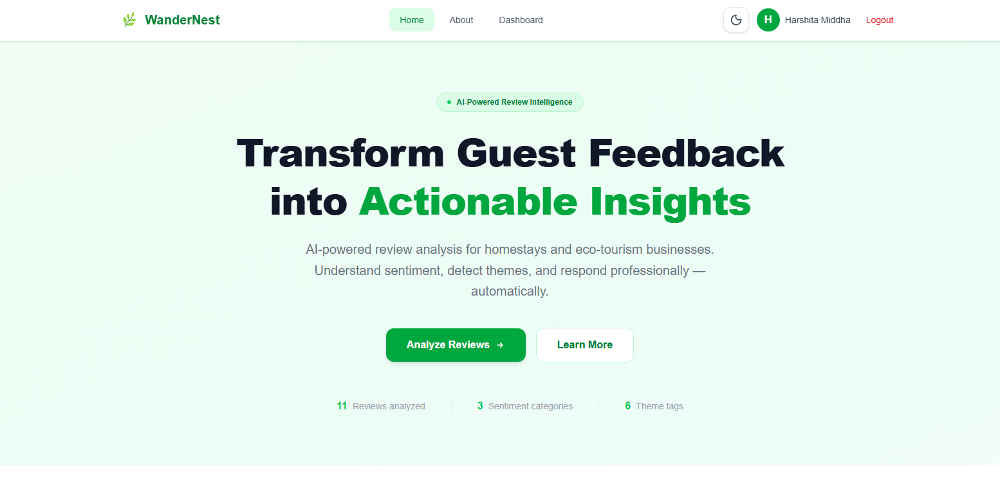

# 🌿 WanderNest

An AI-powered review intelligence platform for homestays and eco-tourism businesses that analyzes customer feedback, performs sentiment analysis, and provides actionable business insights through an interactive dashboard.

---

# 🌐 Live Demo

**Frontend (Vercel):**  
https://wander-nest-iota.vercel.app

**Backend API (Render):**  
https://wandernest-backend-1ota.onrender.com

---

# 📸 Screenshots

## 🏠 Home Page



A responsive landing page introducing WanderNest and its AI-powered review analytics capabilities.

---

## 🔐 Login Page


Secure authentication using Email/Password (JWT) and Google OAuth.

---

## 📊 Dashboard


Displays review analytics, sentiment distribution, review statistics, and recent customer feedback.

---

## 📝 Reviews & AI Analysis


Manage guest reviews with full CRUD operations and analyze customer feedback using AI. The analyzer provides sentiment, confidence score, summary, positive and negative themes, and actionable business suggestions.

AI-analyzed reviews can also be saved directly into the review management system.

---

# ✨ Features

- 🔐 Secure User Authentication (JWT)
- 🔑 Google OAuth Login
- 👤 User Registration & Login
- 📊 Interactive Review Analytics Dashboard
- 🤖 AI-powered Guest Review Analysis
- 😊 Sentiment Classification
- 📊 AI Confidence Scoring
- 📝 AI-generated Review Summarization
- 🔎 Positive & Negative Theme Detection
- 💡 Actionable Business Recommendations
- 💾 Save AI Analysis as a Review
- 📝 Full Review CRUD Operations
- 🔍 Review Search & Management
- 📊 Review Sentiment & Statistical Analytics
- 💾 MongoDB Atlas Integration
- 📱 Fully Responsive Design
- ⚡ RESTful API Architecture

---
# 🤖 AI Review Intelligence Workflow

WanderNest provides an end-to-end AI-powered review analysis workflow:

```text
Guest Review
     ↓
AI Review Analyzer
     ↓
Hugging Face Inference API
     ↓
┌─────────────────────────┐
│ Sentiment               │
│ Confidence Score        │
│ Review Summary          │
│ Positive Themes         │
│ Negative Themes         │
│ Business Suggestions    │
└─────────────────────────┘
     ↓
Save Analysis as Review
     ↓
Review Form
     ↓
MongoDB
     ↓
Review Analytics Dashboard
```
---

# 🛠 Tech Stack

## Frontend

- Next.js 16
- React
- TypeScript
- Tailwind CSS
- Axios

## Backend

- Node.js
- Express.js
- Passport.js
- JWT Authentication
- bcrypt
- express-session

## Database

- MongoDB Atlas
- Mongoose

## AI

- Hugging Face Inference API

## Deployment

- Vercel (Frontend)
- Render (Backend)
- MongoDB Atlas (Database)

---

# 🚀 Setup Instructions

## 1. Clone the Repository

```bash
git clone https://github.com/Harshitamiddha05/WanderNest.git
cd WanderNest
```

---

## 2. Install Frontend Dependencies

```bash
npm install
```

---

## 3. Install Backend Dependencies

```bash
cd backend
npm install
```

---

## 4. Create Backend Environment Variables

Create a `.env` file inside the `backend` folder.

```env
PORT=5000

MONGODB_URI=your_mongodb_connection_string

JWT_SECRET=your_jwt_secret

SESSION_SECRET=your_session_secret

GOOGLE_CLIENT_ID=your_google_client_id

GOOGLE_CLIENT_SECRET=your_google_client_secret

GOOGLE_CALLBACK_URL=http://localhost:5000/api/auth/google/callback

FRONTEND_URL=http://localhost:3000

HF_API_KEY=your_huggingface_api_key
```

---

## 5. Create Frontend Environment Variables

Create a `.env.local` file in the project root.

```env
NEXT_PUBLIC_API_URL=http://localhost:5000/api
```

---

## 6. Run Backend

```bash
cd backend
npm run dev
```

Backend runs on:

```
http://localhost:5000
```

---

## 7. Run Frontend

```bash
npm run dev
```

Frontend runs on:

```
http://localhost:3000
```

---

# 🔗 API Documentation

## Authentication

### Register

```
POST /api/auth/register
```

Request

```json
{
  "name": "Harshita",
  "email": "user@gmail.com",
  "password": "123456"
}
```

Response

```json
{
  "success": true,
  "message": "User Registered Successfully"
}
```

---

### Login

```
POST /api/auth/login
```

Request

```json
{
  "email": "user@gmail.com",
  "password": "123456"
}
```

Response

```json
{
  "token": "jwt_token",
  "user": {
    "name": "Harshita",
    "email": "user@gmail.com"
  }
}
```

---

### Google OAuth

```
GET /api/auth/google
```

Starts Google authentication.

---

### User Profile

```
GET /api/auth/profile
```

Requires JWT token.

---

## Reviews

| Method | Endpoint |
|---------|----------|
| GET | /api/reviews |
| GET | /api/reviews/:id |
| POST | /api/reviews |
| PUT | /api/reviews/:id |
| DELETE | /api/reviews/:id |
| GET | /api/reviews/search |

---

## Dashboard

| Method | Endpoint |
|---------|----------|
| GET | /api/dashboard/stats |
| GET | /api/dashboard/recent-reviews |

---

## AI

### Analyze Review

```
POST /api/ai/review-analysis
```

Request

```json
{
  "review":"The room was clean and staff were very helpful."
}
```

Example Response

```json
{
  "sentiment":"Positive",
  "confidence":"91%",
  "summary":"Guests appreciated cleanliness and staff behavior.",
  "positive_themes":[
    "Cleanliness",
    "Staff"
  ],
  "negative_themes":[],
  "business_suggestions":[
    "Maintain current service quality."
  ]
}
```

---

# 🏗 Architecture / Folder Structure

```
WanderNest
│
├── app/
│   ├── about/
│   ├── dashboard/
│   ├── login/
│   ├── register/
│   ├── reviews/
│   └── page.tsx
│
├── components/
│   ├── Navbar.tsx
│   ├── Hero.tsx
│   ├── Footer.tsx
│   └── reviews/
│
├── backend/
│   ├── config/
│   ├── controllers/
│   ├── middleware/
│   ├── models/
│   ├── routes/
│   ├── services/
│   └── server.js
│
├── public/
├── screenshots/
├── README.md
└── package.json
```

### Architecture Overview

- **Next.js** powers the frontend user interface.
- **Express.js** provides RESTful backend APIs.
- **MongoDB Atlas** stores user and review data.
- **Passport.js** manages Google OAuth authentication.
- **JWT** secures protected routes.
- **Hugging Face AI** performs sentiment analysis and review summarization.

### Review Intelligence Flow

1. User submits a guest review through the Next.js frontend.
2. Frontend sends the review to the Express.js AI endpoint.
3. Backend sends the review to the Hugging Face Inference API.
4. AI-generated sentiment and review insights are returned to the frontend.
5. User can review the analysis and choose to save it as a review.
6. The existing review CRUD API stores the review in MongoDB Atlas.
7. Dashboard APIs provide aggregated review statistics and recent feedback.

---

# ⚠ Known Limitations

- Render free tier may take 30–60 seconds to wake up after periods of inactivity.
- Hugging Face API usage may be subject to rate limits and availability constraints.
- AI analysis response time depends on the availability and response time of the external Hugging Face API.
- AI-generated insights are intended as decision-support information and may not always be perfectly accurate.
- Email verification is not currently implemented.
- Password reset functionality is not currently available.
- Google OAuth requires proper Google Cloud credentials and callback configuration for deployment.

---

# 🙏 Credits & Acknowledgements

This project was developed as part of the **AI-Assisted Full Stack Web Development Internship**.

Technologies and services used include:

- Hugging Face
- Next.js
- React
- Express.js
- MongoDB Atlas
- Passport.js
- JWT
- Tailwind CSS
- Render
- Vercel
- GitHub
- Postman

# 👩‍💻 Author

**Harshita Middha**

B.Tech CSE (Artificial Intelligence & Data Science)

Graphic Era (Deemed to be University), Dehradun

AI-Assisted Full Stack Web Development Internship

---

# 📄 License

This project was developed for educational and internship purposes.
