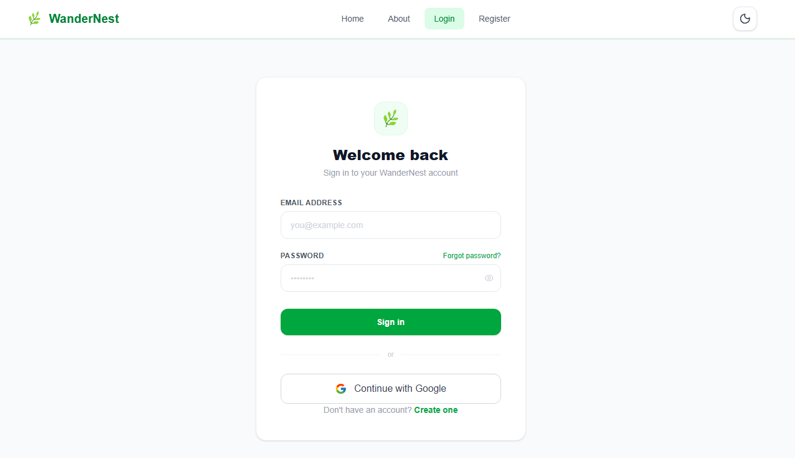
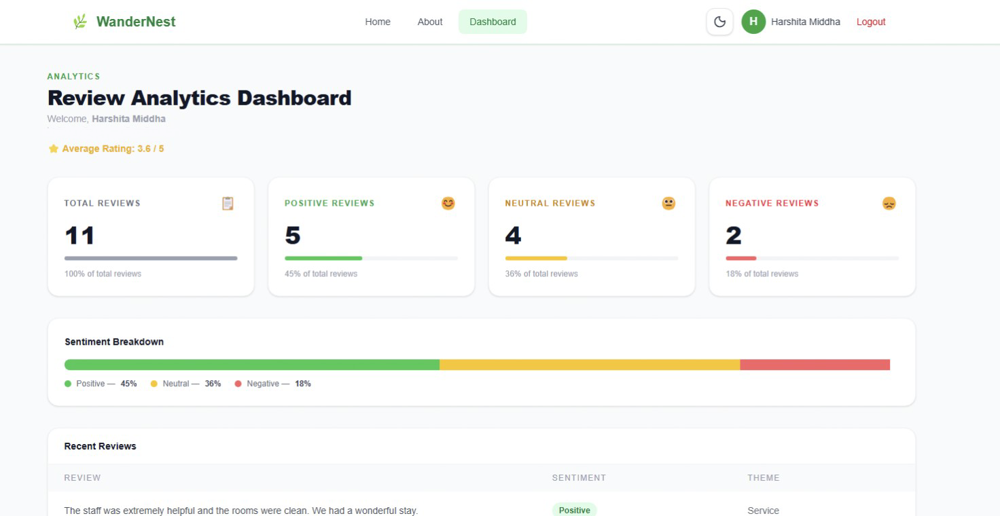
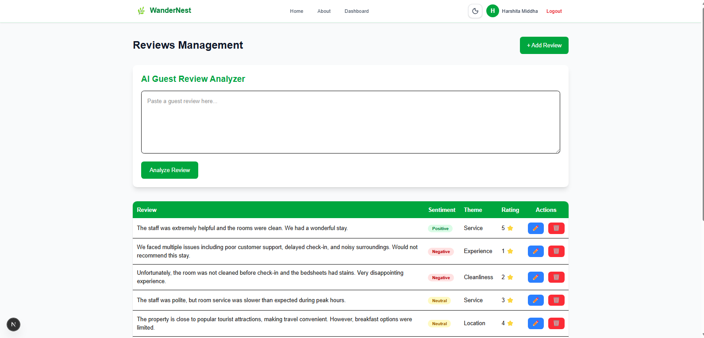

# 🌿 WanderNest

WanderNest is an AI-powered review intelligence platform designed for homestay and eco-tourism businesses. The platform enables property owners to analyze customer reviews, understand guest sentiment, identify recurring themes, manage reviews, and securely authenticate users through JWT-based authentication.


---
## ✨ Project Highlights

- 🤖 AI-powered Guest Review Analyzer
- 📊 Interactive Review Analytics Dashboard
- 🔐 JWT Authentication (Email/Password + Google OAuth 2.0)
- ☁️ MongoDB Atlas Cloud Database
- 📝 Complete Review CRUD Operations
- 📱 Responsive Next.js Frontend
- ⚡ RESTful Express.js Backend

# 📌 Project Overview

WanderNest helps eco-tourism businesses make data-driven decisions by leveraging AI and modern web technologies. The platform provides review management, sentiment analysis, authentication, and an interactive dashboard to improve customer experience.

---

# 🚀 Features

## Review Management

- Create Reviews
- View All Reviews
- View Review by ID
- Update Reviews
- Delete Reviews
- Search Reviews
- Review Analytics Dashboard
- Responsive Review Management Interface
- Dashboard Statistics
- Recent Reviews Panel

## AI Features

- AI-powered Guest Review Analysis
- Sentiment Analysis
- Confidence Score Generation
- Theme Detection (Positive & Negative)
- AI-generated Review Summary
- Business Recommendations

## Authentication & Security

- User Registration
- User Login
- Google OAuth 2.0 Login (Passport.js)
- Password Hashing using bcrypt
- JWT Authentication
- Protected API Routes
- User Profile Endpoint
- Persistent Login using Local Storage
- Duplicate Email Validation
- Invalid Login Handling
- Secure Logout

## User Interface

- Responsive Design
- Modern Dashboard
- Mobile Friendly
- Dark Mode Support (if enabled)

---

# 🛠 Tech Stack

## Frontend

- Next.js 16
- React
- TypeScript
- Tailwind CSS
- Axios

## Backend

- Node.js
- Express.js
- MongoDB Atlas
- Mongoose
- JWT
- Passport.js
- passport-google-oauth20
- bcrypt
- express-rate-limit
- Hugging Face Inference API

## Development Tools

- Git
- GitHub
- Postman
- MongoDB Compass / MongoDB Atlas

---

## 📂 Project Structure

```text
WanderNest
│
├── app
│   ├── about
│   ├── dashboard
│   ├── login
│   ├── register
│   ├── reviews
│   └── page.tsx
│
├── components
│   ├── reviews
│   │   ├── DeleteDialog.tsx
│   │   ├── ReviewForm.tsx
│   ├── Navbar.tsx
│   ├── Footer.tsx
│   └── Hero.tsx
│
├── backend
│   ├── config
│   ├── controllers
│   │   ├── authController.js
│   │   ├── dashboardController.js
│   │   ├── reviewController.js
│   │   └── aiController.js
│   ├── middleware
│   ├── models
│   ├── routes
│   ├── services
│   ├── server.js
│   └── package.json
│
├── public
├── README.md
├── screenshots/
│   ├── login.png
│   ├── dashboard.png
│   ├── google-login.png
│   ├── ai-analyzer.png
│   ├── reviews.png
│   └── mobile-view.png
└── package.json
```
---

# 📄 Pages

- Home
- About
- Dashboard
- Login
- Register
- Reviews

---

# 🔗 API Endpoints

## Authentication APIs

| Method |          Endpoint         |      Description        |
|--------|---------------------------|-------------------------|
|  POST  |    /api/auth/register     |       Register User     |
|  POST  |      /api/auth/login      |      Login User         |
|   GET  |     /api/auth/profile     | Protected Profile Route |
|   GET  |     /api/auth/google      |   Google OAuth Login    |
|   GET  | /api/auth/google/callback |  Google OAuth Callback  |

---

## Review APIs

| Method |        Endpoint        |    Description   |
|--------|------------------------|------------------|
|   GET  |      /api/reviews      | Get All Reviews  |
|   GET  |    /api/reviews/:id    | Get Review by ID |
|  POST  |      /api/reviews      |   Create Review  |
|   PUT  |    /api/reviews/:id    |   Update Review  |
| DELETE |    /api/reviews/:id    |   Delete Review  |
|   GET  | /api/reviews/search?q= |   Search Reviews |

---
## Dashboard APIs

| Method |            Endpoint           |              Description               |
|--------|-------------------------------|----------------------------------------|
| GET    |      /api/dashboard/stats     |  Retrieve dashboard review statistics  |
| GET    | /api/dashboard/recent-reviews |     Retrieve recent guest reviews      |

## AI APIs

| Method |             Endpoint            |                  Description                 |
|--------|---------------------------------|----------------------------------------------|
|  POST  |      /api/ai/review-analysis    | Analyze a guest review using Hugging Face AI |

Example Request

```json
{
  "review": "The room was clean and spacious. Staff were friendly but the WiFi was slow."
}
```

Example Response

```json
{
  "success": true,
  "data": {
    "sentiment": "Positive",
    "confidence": "90%",
    "summary": "Guests appreciated the cleanliness and staff, but reported slow WiFi.",
    "positive_themes": [
      "Cleanliness",
      "Friendly Staff"
    ],
    "negative_themes": [
      "Slow WiFi"
    ],
    "business_suggestions": [
      "Improve internet connectivity.",
      "Maintain current service quality."
    ]
  }
}
```
# 📦 Installation

## Clone Repository

```bash
git clone https://github.com/Harshitamiddha05/WanderNest.git
```

## Navigate

```bash
cd WanderNest
```

---

# ▶ Frontend Setup

Install dependencies

```bash
npm install
```

Run

```bash
npm run dev
```

Frontend:

```
http://localhost:3000
```

---

# ▶ Backend Setup

Navigate

```bash
cd backend
```

Install dependencies

```bash
npm install
```

Create a `.env` file

```env
PORT=5000
MONGODB_URI=<your_mongodb_connection_string>
JWT_SECRET=<your_jwt_secret>
HF_API_KEY=<your_huggingface_api_key>
GOOGLE_CLIENT_ID=<your_google_client_id>
GOOGLE_CLIENT_SECRET=<your_google_client_secret>
```

Run Backend

```bash
npm run dev
```

Backend:

```
http://localhost:5000
```

---

# 🗄 Database

MongoDB Atlas is used as the cloud database to store:

- User Accounts
- Guest Reviews
- Authentication Data
- Review Analytics Data

Mongoose is used for schema definition and validation.

---

# 🔐 Authentication Flow

### Email Authentication

1. User Registration
2. Password hashed using bcrypt
3. User Login
4. JWT Token Generated
5. Protected Routes verified using JWT middleware

### Google OAuth Authentication

1. User clicks "Continue with Google"
2. Passport.js redirects to Google
3. User grants permission
4. Google redirects back to backend
5. Backend generates JWT
6. Frontend stores JWT and user profile
7. Protected dashboard becomes accessible

---

# 🧪 API Testing

All APIs were tested using Postman.

Verified APIs include:

- User Registration
- User Login
- Protected Route
- Create Review
- Get Reviews
- Update Review
- Delete Review
- Search Reviews
- AI Review Analysis Endpoint
- Google OAuth Authentication
- User Profile Endpoint

---

# 📸 Application Screenshots

The project documentation includes screenshots of:

- Authenticated Dashboard
- Review Management Dashboard
- Add Review Dialog
- Edit Review Dialog
- Delete Confirmation Dialog
- AI Guest Review Analyzer
- MongoDB Atlas Integration
- Responsive Mobile & Desktop Layout
- Network Request Verification using Chrome DevTools
- Google OAuth Login
- Authenticated Navbar

---
# 📸 Screenshots

## Login Page



---

## Dashboard



---

## Google OAuth Login


---

## AI Review Analyzer


---

## Review Management


# 📚 Internship Progress

## Week 2

- Responsive UI
- Navbar
- Hero Section
- Footer
- Dashboard
- About Page

## Week 5

- MongoDB Integration
- Mongoose Models
- CRUD APIs
- Search API
- Frontend-Backend Integration
- Postman Testing

## Week 6

- User Authentication
- JWT Implementation
- Password Hashing (bcrypt)
- Protected Routes
- Authentication Middleware
- Secure Login & Registration

---
## Week 7

- Integrated Hugging Face AI API
- Implemented AI-powered Guest Review Analyzer
- Added Sentiment Analysis
- Added Confidence Score Generation
- Added Theme Detection
- Added AI-generated Review Summary
- Added Business Recommendations
- Connected AI Backend with Next.js Frontend
- Implemented Loading and Error Handling
- Tested AI APIs using Postman

## Week 8

- Integrated Google OAuth 2.0 authentication using Passport.js
- Configured Google Cloud OAuth credentials
- Implemented OAuth callback flow
- Generated JWT after successful Google authentication
- Added protected `/api/auth/profile` endpoint
- Connected frontend authentication with backend
- Implemented persistent login using Local Storage
- Updated Navbar dynamically based on authentication state
- Integrated Review Analytics Dashboard with MongoDB Atlas
- Connected frontend components to live backend APIs
- Completed Review CRUD operations
- Added AI Guest Review Analyzer interface
- Implemented Delete Confirmation Dialog
- Improved responsive design
- Verified frontend-backend communication using Chrome DevTools

# 👩‍💻 Author

**Harshita Middha**

AI-Assisted Full Stack Web Development Internship

TBI-GEU

---

# ⭐ Future Enhancements

- GitHub OAuth Login
- Batch Review Analysis
- Multilingual Review Analysis
- AI-generated Reply Suggestions
- Advanced Analytics Dashboard
- Review Trend Visualization
- Email Verification
- Password Reset
- Role-Based Authorization
- User-specific Dashboard Analytics
- Review Export (CSV/PDF)
- Advanced Charts using Chart.js
- Email Notifications

## 📄 License

This project was developed as part of the AI-Assisted Full Stack Web Development Internship at TBI-GEU.